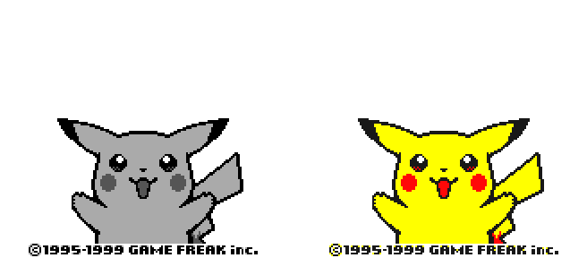
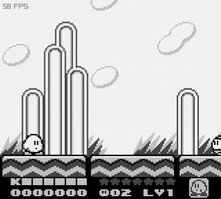
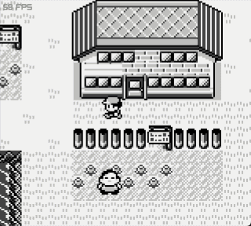
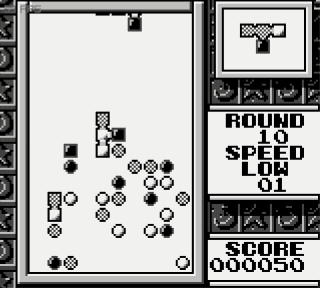
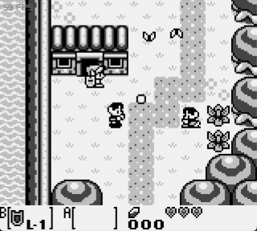
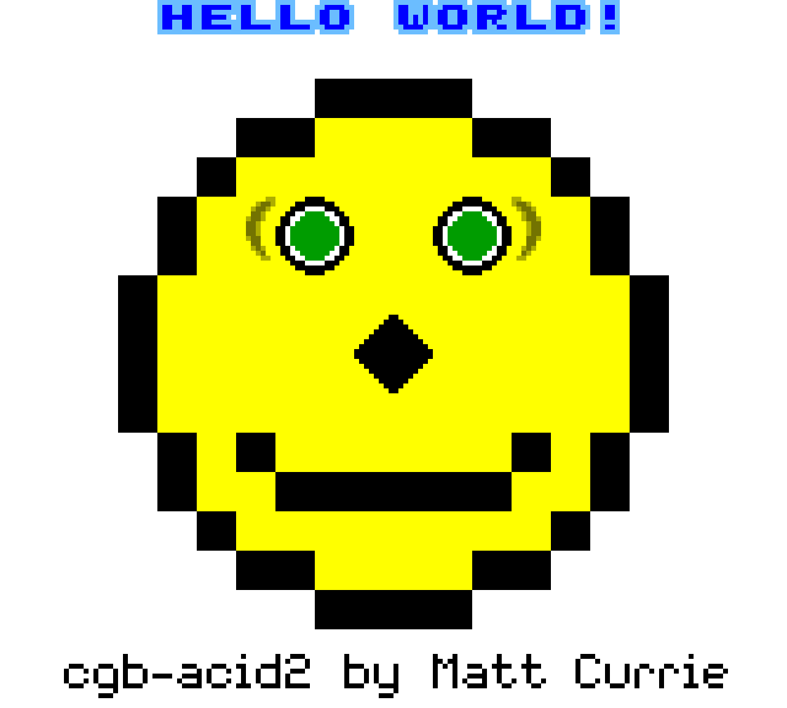

<h1 align="center">dmg</h1>

<p align="center">
  A Game Boy and Game Boy Color emulator written in C.
</p>

<p align="center">
  <a href="https://github.com/zalcb/dmg/actions/workflows/core.yml"></a>
  <a href="core"></a>
  <a href="https://www.raylib.com/"></a>
  <a href="#building-and-running-locally"></a>
</p>

<p align="center">
  
  <br>
  <sub>Pokémon Yellow in Game Boy mode (left) and Game Boy Color mode (right).</sub>
</p>

The goal is to have a fully functional program that can faithfully emulate the Game Boy hardware and its games, especially commercial titles. The emulator is stable and runs games like Kirby, Tetris 2, Zelda and Pokémon. Game Boy Color support is newer and still being tested.

Want to read more about the project and my learning experience? Check out my personal website and (WIP) blog: [zalcberg.me](https://zalcberg.me).

---

## Media

### Games

<table>
  <tr>
    <td align="center"><a href="public/showcase/kirby.mp4"></a><br><sub>Kirby's Dream Land 2</sub></td>
    <td align="center"><a href="public/showcase/pokemon.mp4"></a><br><sub>Pokémon Red</sub></td>
  </tr>
  <tr>
    <td align="center"><a href="public/showcase/tetris.mp4"></a><br><sub>Tetris 2</sub></td>
    <td align="center"><a href="public/showcase/zelda.mp4"></a><br><sub>Zelda</sub></td>
  </tr>
</table>

Click a game to watch the video. The recordings have no sound, but the emulator does.

### Test ROMs

<table>
  <tr>
    <td align="center"><br><sub>Blargg's CPU instructions</sub></td>
    <td align="center"><br><sub>DMG Acid2</sub></td>
    <td align="center"><br><sub>CGB Acid2</sub></td>
  </tr>
</table>

---

## Features

- **CPU**: the complete SM83 instruction set, passing Blargg's instruction and timing tests.
- **Graphics**: background, window and sprites at 160 × 144, plus Game Boy Color palettes, VRAM banks and double speed mode.
- **Audio**: all four channels (two pulse, wave and noise) in 48 kHz stereo.
- **Cartridges**: ROM only, MBC1, MBC2, MBC3 (with RTC) and MBC5.
- **Frontend**: keyboard input, display and audio using [raylib](https://www.raylib.com/).
- **Headless mode**: runs the core without a window for tests and debugging, on macOS and Linux.

## Building and running locally

Currently, the emulator is only supported on macOS, which is my development environment. You will need [Homebrew](https://brew.sh/) and the Xcode Command Line Tools.

```bash
git clone https://github.com/zalcb/dmg.git
cd dmg
brew install raylib pkg-config
make
```

This builds two binaries. `gb` runs everything as an original Game Boy, and `gbc` runs color games in color:

```bash
./gb <path_to_rom>
./gbc <path_to_rom>
```

Run them from the root of the project so the emulator can find the boot ROM. Game ROMs are not included, so you will need your own.

| Game Boy | Keyboard |
| :--- | :--- |
| D-pad | Arrow keys |
| A | <kbd>Z</kbd> |
| B | <kbd>X</kbd> |
| Start | <kbd>Enter</kbd> |
| Select | <kbd>Space</kbd> |

Tests, debug builds, benchmarks and the project structure are covered in the [developer guide](docs/development.md).

## Roadmap

| Stage | Description | Status |
| :---: | :--- | :---: |
| 0 | Project setup | ✅ |
| 1 | Core emulator w/ CPU emulation and complete instruction set | ✅ |
| 2 | PPU emulation (part 1) | ✅ |
| 3 | Bank switching | ✅ |
| 4 | PPU emulation (part 2) | ✅ |
| 5 | Joypad support (keyboard) | ✅ |
| 6 | MBC2 and MBC3 support (RTC) | ✅ |
| 7 | APU | ✅ |
| 8 | MBC5 and Game Boy Color support | ✅ |
| 9 | QOL and timing improvements | ❌ |
| 10 | Modern joypads (DualSense and Xbox controllers) | ❌ |

## Sources

This project was only possible thanks to the following resources:

1. [Pan Docs](https://gbdev.io/pandocs/)
2. [Game Boy Memory Map](http://gameboy.mongenel.com/dmg/asmmemmap.html)
3. [gbops](https://izik1.github.io/gbops/), an accurate opcode table
4. [gbz80(7)](https://rgbds.gbdev.io/docs/v0.9.2/gbz80.7), the SM83 opcode reference
5. [Game Boy: Complete Technical Reference](https://gekkio.fi/files/gb-docs/gbctr.pdf)
6. [Blargg's test ROMs](https://github.com/retrio/gb-test-roms), [DMG Acid2](https://github.com/mattcurrie/dmg-acid2) and [CGB Acid2](https://github.com/mattcurrie/cgb-acid2)
